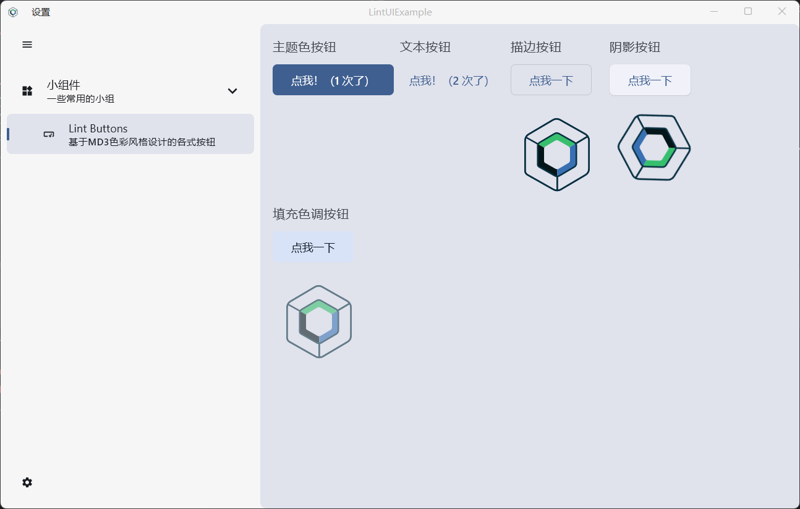
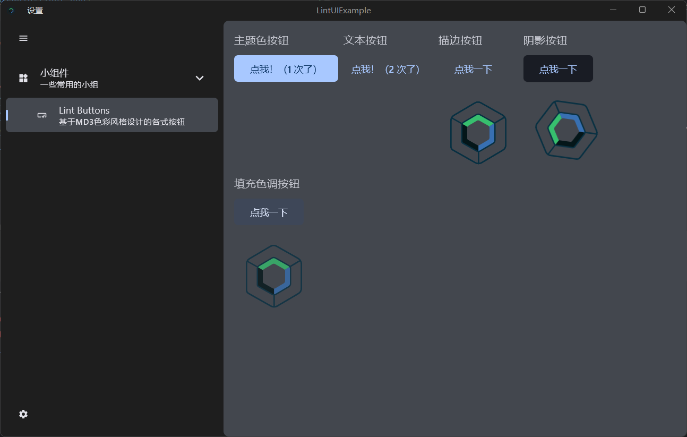

# Lint UI for Compose Desktop
 A Compose Desktop UI framework supporting global theme control. (aka LintUI)

## Introduce
This is a UI framework developed for Compose Desktop, 
and it integrates many features that normal applications 
should have (such as data persistence).
This UI framework will remain open source and free.

## Features
- [x] Support the Root Panel covering the whole window (Lint Window)
- [x] Material Design3 color matching style (Lint Theme Scope)
- [x] Commonly used widgets
   - [x] Buttons (Lint Button)
   - [x] Cards (Lint Card)
   - [x] Dividers (Lint Dividers)
   - [x] Folded container (Lint Folder)
   - [x] Minimizable, collapsible and nestable side navigation bar (Lint Side)
   - [ ] More beautiful and practical UI components will continue to be developed in the future
- [x] A simple context provider
- [x] Shared Preferences based on SQLite (SharedPreferences)
- [x] Out of the box theme management store (Lint Theme Store)
- [x] Out-of-box theme installation framework
- [x] Unify the global theme
- [x] Dynamic perception system dark mode
- [ ] More features will be continuously updated in the future

## Screen shoot
The developer has not prepared a screenshot of the demo,
please run the demo application temporarily to see the effect. 🌹🌹🌹

## Use this library in your project
The developer has not prepared the relevant documents, please wait patiently. Thanks.

## Excellent cited framework or repositories (Rank insensitive)
* [FlatLat](https://github.com/JFormDesigner/FlatLaf)
* [Exposed](https://github.com/JetBrains/Exposed)
* [Gson](https://github.com/google/gson)
* [JSystemThemeDetector](https://github.com/Dansoftowner/jSystemThemeDetector)

## End