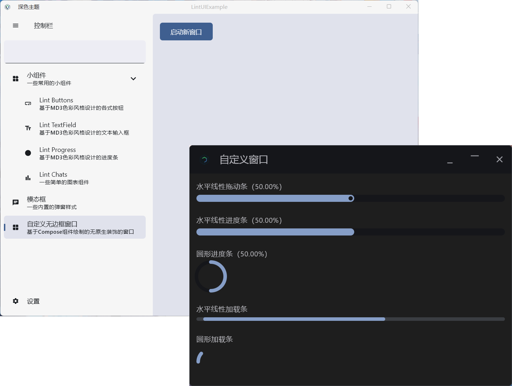

# Lint UI for Compose Desktop

[](LICENSE)
[](https://github.com/lumkit/lint-ui/releases)
[](https://central.sonatype.com/artifact/io.github.lumkit/lint-compose-ui/)

A Compose Desktop UI framework supporting global theme control. (aka LintUI)

## Introduce

This is a UI framework developed for Compose Desktop (on Material Design 3),
and it integrates many features that normal applications
should have (such as data persistence).
This UI framework will remain open source and free.

## Features

- [x] Support the Root Panel covering the whole window (Lint Window)
- [x] Material Design3 color matching style (Lint Theme Scope)
- [x] Commonly used widgets
    - [x] Buttons (Lint Button)
    - [x] Cards (Lint Card)
    - [x] Dividers (Lint Dividers)
    - [x] Folded container (Lint Folder)
    - [x] Minimizable, collapsible and nestable side navigation bar (Lint Side)
    - [x] Flexible window without native decoration (Lint Layer Window)
    - [x] Dialog of basic style (Lint Dialog)
    - [x] Toast (Lint Window Toast)
    - [x] Circle Indicator & Linear Indicator (Lint Progress/Lint Indicator)
    - [x] Stack Chart (Lint Stack Chart)
    - [ ] More beautiful and practical UI components will continue to be developed in the future
- [x] A simple context provider
- [x] Shared Preferences based on SQLite (SharedPreferences)
- [x] Out of the box theme management store (Lint Theme Store)
- [x] Out-of-box theme installation framework
- [x] Unify the global theme
- [x] Dynamic perception system dark mode
- [x] View Model Store
- [ ] More features will be continuously updated in the future

## Screen shoot



## Use this library in your project

Before that, you can run the example we provided for you to see the concrete effect.

```shell
./gradlew desktopRun -DmainClass=MainKt --quiet
```

### LintUI framework version requirements

| Lint UI | Kotlin | Compose Framework | Compose Plugin |   Java   |
|:-------:|:------:|:-----------------:|:--------------:|:--------:|
|  1.0.1  | 1.9.22 |       1.6.2       |     1.6.0      | JDK 17++ |
|  1.0.2  | 1.9.22 |       1.6.2       |     1.6.0      | JDK 17++ |
|  1.0.3  | 1.9.22 |       1.6.2       |     1.6.0      | JDK 17++ |
|  1.0.4  | 1.9.22 |       1.6.2       |     1.6.0      | JDK 17++ |
|  1.0.5  | 1.9.22 |       1.6.2       |     1.6.0      | JDK 17++ |
|  1.0.6  | 1.9.22 |       1.6.2       |     1.6.0      | JDK 17++ |

### 1. Configure the Maven central warehouse for the project.

```kotlin
dependencyResolutionManagement {
    repositories {
        google()
        mavenCentral()
        maven(url = "https://jitpack.io")
        maven("https://maven.pkg.jetbrains.space/public/p/compose/dev")
    }
}
```

### 2. Import the [lint-compose-ui] dependency.

```kotlin
dependencies {
    // You just import dependencies such as jb-compose-desktop-currentOs and jb-compose-components-resources.

    // Base on KMP
    implementation("io.github.lumkit:lint-compose-ui:1.0.6")
    // Only Desktop
    implementation("io.github.lumkit:lint-compose-ui-desktop:1.0.6")
}
```

### 3. Start writing your first desktop application

```kotlin
import androidx.compose.foundation.layout.fillMaxSize
import androidx.compose.ui.Modifier
import androidx.compose.ui.window.MenuBar
import io.github.lumkit.desktop.context.LocalContext
import io.github.lumkit.desktop.data.DarkThemeMode
import io.github.lumkit.desktop.example.App
import io.github.lumkit.desktop.lintApplication
import io.github.lumkit.desktop.ui.LintWindow
import io.github.lumkit.desktop.ui.theme.AnimatedLintTheme
import io.github.lumkit.desktop.ui.theme.LocalThemeStore
import lint_ui.example.generated.resources.*
import org.jetbrains.compose.resources.ExperimentalResourceApi
import org.jetbrains.compose.resources.painterResource
import org.jetbrains.compose.resources.stringResource
import java.awt.Dimension

@OptIn(ExperimentalResourceApi::class)
fun main() = lintApplication(
    packageName = "LintUIExample"
) {
    val context = LocalContext.current

    // Toggles the global dark theme mode.
    LintWindow(
        onCloseRequest = ::exitApplication,
        rememberSize = true,
        title = context.getPackageName(),
        icon = painterResource(Res.drawable.compose_multiplatform),
    ) {
        AnimatedLintTheme(
            modifier = Modifier.fillMaxSize(),
        ) {
            Text("Hello Lint UI!")
        }
    }
}
```

## How to use some built-in APIs.

* Context
   ```kotlin
    // Get global context
    val context = LocalContext.current

    // App work path
    val filesDir = context.getFilesDir()

    // App package name
    val packageName = context.getPackageName()

    // Persistent file name of App (based on sqlite implementation)
    val sharedPreferences = context.getSharedPreferences("shared preference file name")

    // Gets the theme instance in the specified persistence file.
    val theme = context.getTheme(sharedPreferences = sharedPreferences)
   ```

* Shared Preferences
   ```kotlin
    // Gets the global SharedPreferences instance.
    val sharedPreferences = LocalSharedPreferences.current

    // Get the data in the hardware (is-dark is virtual).
    val isDark = sharedPreferences.get<String>("is-dark")

    // Put string
    sharedPreferences.putString("is-dark", isDark)
    // Put type data
    sharedPreferences.put("type-data", arrayListOf("Dark", "Light"))
   ```

* ViewModel
  ```kotlin
  // Create a new entity class that inherits ViewModel[io.github.lumkit.desktop.lifecycle.ViewModel], such as "MyViewModel".
  class MyViewModel : ViewModel() {
  
      private val _text = MutableStateFlow("")
      val text: StateFlow<String> = _text.asStateFlow()
  
      fun setText(text: String) {
          _text.value = text
      }
  
  }
  
  // use view model and state
  val viewModel = viewModel<MyViewModel>()
  val text by viewModel.text.collectAsState()
  
  LintTextField(
      value = text,
      onValueChange = viewModel::setText,
      label = {
          Text("输入内容")
      }
  )
  ```

* More built-in APIs will be gradually opened, so stay tuned

## Excellent cited framework or repositories (Rank insensitive)

* [FlatLat](https://github.com/JFormDesigner/FlatLaf)
* [Exposed](https://github.com/JetBrains/Exposed)
* [Gson](https://github.com/google/gson)
* [JSystemThemeDetector](https://github.com/Dansoftowner/jSystemThemeDetector)

## End